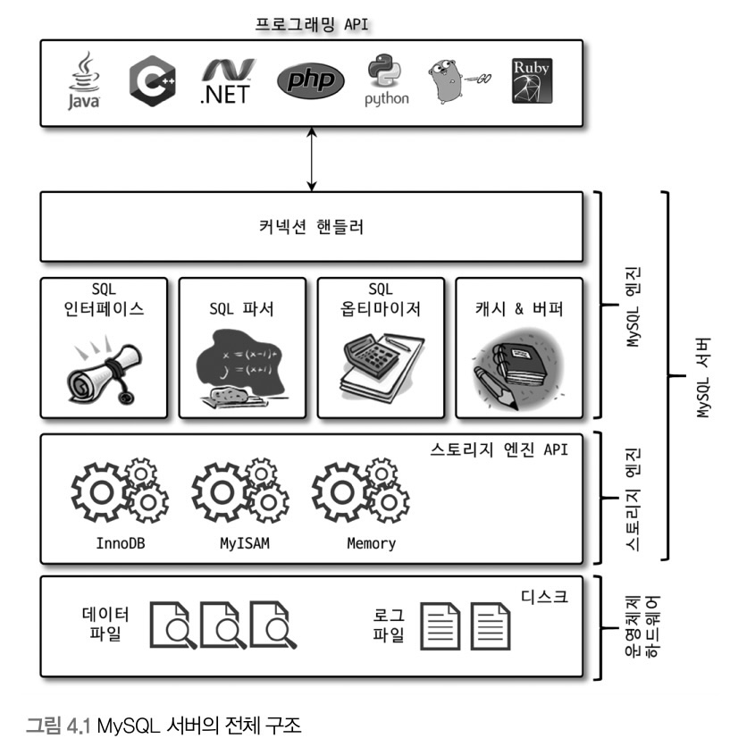
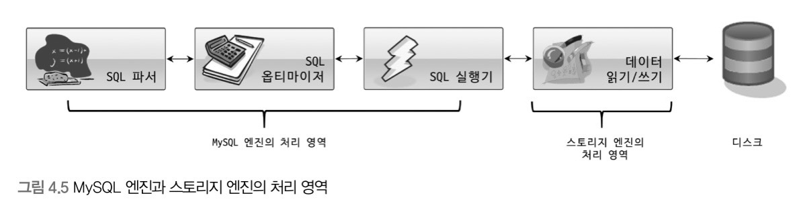
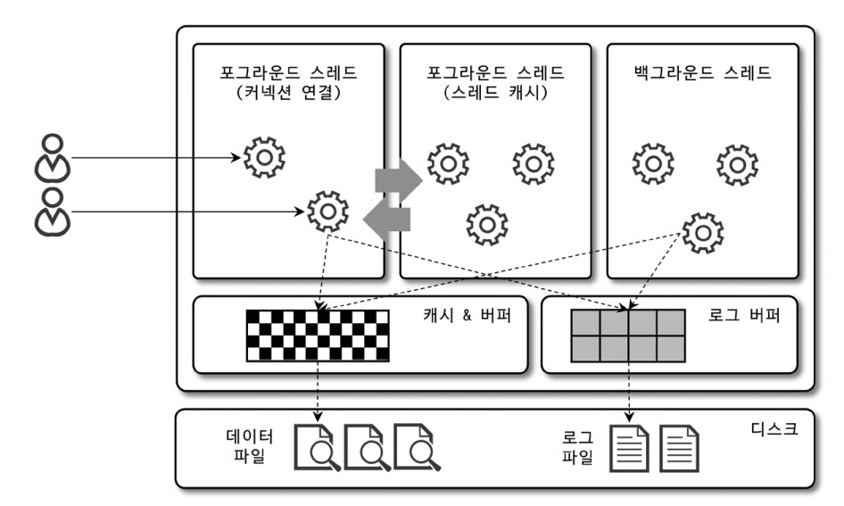
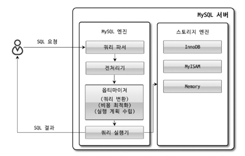

## MySQL 구조
  
  
*MySQL 서버는 크데 MySQL 엔진과 스토리지 엔진으로 구분된다.*

### MySQL 엔진
- 클라이언트로부터의 접속 및 쿼리 요청을 처리하는 커넥션 핸들러와 SQL Parser 및 전처리기,
쿼리의 최적화된 실행을 위한 SQL Optimizer 로 구성

### 스토리지 엔진
- 요청된 SQL 문장을 분석하거나 최적화
- 실제 데이터를 디스크 스토리지에 저장하거나 디스크 스토리지로부터 데이터를 읽어오는 역할을 수행

### 핸들러 API
- MySQL 엔진의 쿼리 실행기에서 데이터를 쓰거나 읽을 때 각 스토리지 엔진에 쓰기 또는 읽기를 요청하고,
이러한 요청들에 사용되는 API
- 스토리지 엔진은 핸들러 API 를 통해 MySQL 엔진과 데이터를 주고 받음

### MySQL 쓰레딩 구조
  
*MySQL 서버는 쓰레드 기반으로 작동하며, 크게 포그라운드 쓰레드와 백그라운드 쓰레드로 구분된다.*
- Foreground Thread
  - 사용자 쓰레드. 각 클라이언트 사용자가 요청하는 쿼리 문장을 처리
  - 클라이언트 사용자가 작업을 마치고 커넥션을 종료하면 해당 커넥션을 쓰레드 캐시에 반납한다.
    - 쓰레드 캐시에 이미 일정 개수 이상의 대기 중인 쓰레드가 있다면 쓰레드 캐시에 넣지 않고 종료시킴으로서
    쓰레드 캐시에는 일정 개수의 쓰레드를 유지시킨다.
- Background Thread
  - 로그를 디스크로 기록
  - 데이터를 버퍼로 읽음
  - 잠금이나 데드락을 모니터링

### 쿼리 실행 구조

- Query Parser
  - 사용자 요청으로 들어온 쿼리 문장을 토큰으로 분리해 트리 형태의 구조로 만들어내는 작업.
  이 과정에서 기본 문법 오류가 발견되고 사용자에게 오류 메시지를 전달하게 된다.
    - 토큰
      - MySQL 이 인식할 수 있는 최소 단위의 어휘나 기호
- 전처리기
  - Query Parser 단계에서 만들어진 Parser Tree 를 기반으로 쿼리 문장에 구조적인 문제점이 있는지 확인
- Optimizer
  - 사용자의 요청으로 들어온 쿼리 문장을 저렴한 비용으로 가장 빠르게 처리할지를 결정하는 역할
- 실행엔진
  - 위의 과정에서 만들어진 계획대로 각 핸들러에게 요청해서 받은 결과를 또 다른 핸들러 요청의 입력으로
  연결하는 역할을 수행
- 핸들러
  - MySQL 서버의 가장 밑단에서 MySQL 실행 엔진의 요청에 따라 데이터를 디스크로 저장하고 디스크로부터
  읽어오는 역할을 담당
  - 핸들러는 스토리지 엔진을 의미함