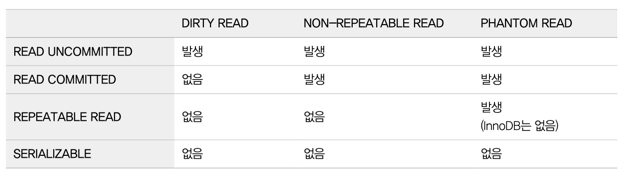
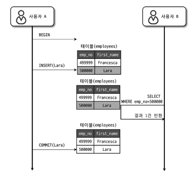
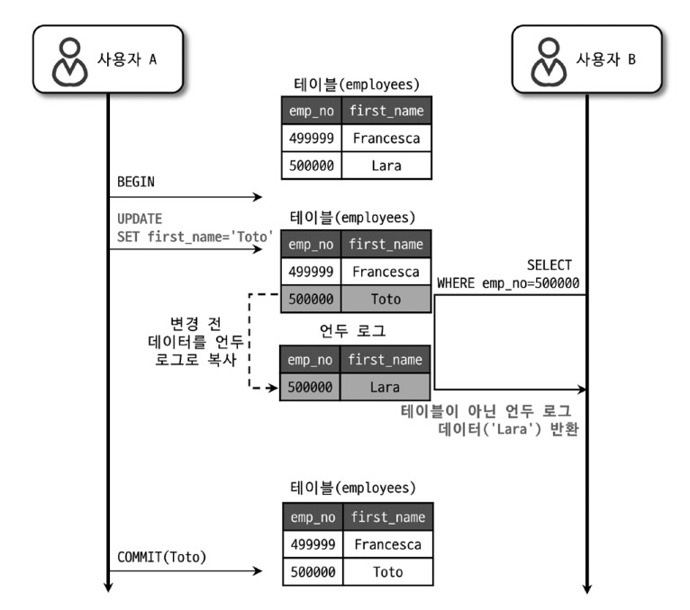
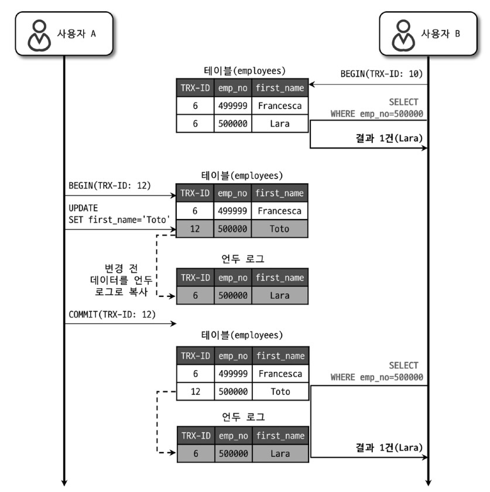
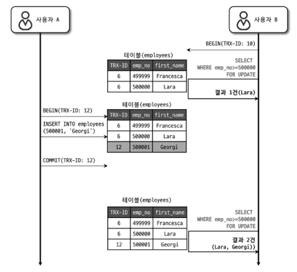

## Transaction
- 논리적인 하나의 작업 셋을 모두 완벽하게 처리하거나, 처리하지 못할 경우에는 이전 상태로 복구해서
작업의 일부만 적용되는 현상이 발생하지 않게 만들어주는 기능
- 데이터의 정합성을 보장하기 위한 기능

### Transaction 범위의 최소화
- Transaction 범위는 프로그램 코드에서 최소화하는 것이 좋다. 트랜잭션이 유지되는 동안 커넥션을
점유하기 때문에 트랜잭션이 길어지면 사용 가능한 여유 커넥션의 개수가 부족해 질 수 있다. 실질적으로
데이터의 변경이 일어나는 부분에 대해서만 트랜잭션의 범위로 설정하는 것을 권장한다.

### Isolation Level - 트랜잭션의 격리수준
- 여러 트랜잭션이 동시에 처리될 때 특정 트랜잭션이 다른 트랜잭션에서 변경하거나 조회하는 데이터를 볼 수 있게
허용하지 말지를 결정하는 것  

- READ UNCOMMITTED
    
  - 각 트랜잭션에서의 변경 내용이 커밋이나 롤백 여부에 상관없이 다른 트랜잭션에서 보이는 격리수준
  - Dirty Read 가 허용되는 격리수준
    - Dirty Read
      - 어떤 트랜잭션에서 처리한 작업이 완료되지 않았음에도 다른 트랜잭션에서 볼 수 있는 현상
  - 결정되지 않은 상태의 데이터가 다른 트랜잭션에서 보이기 때문에 정합성에 문제가 많아 잘 사용되지 않는 격리수준
- READ COMMITTED
    
  - 각 트랜잭션에서 커밋이 완료된 데이터만 다른 트랜잭션에서 보이는 격리수준
  - 오라클에서 기본으로 사용되는 격리수준
  - REPEATABLE READ 가 불가능한, NON-REPEATABLE READ 부정합의 문제가 발생할 수 있다.
    - 어떤 트랜잭션에서 작업을 커밋하여 변경하였을 때, 다른 트랜잭션에서는 커밋 전 조회, 커밋 후 조회를 통해
    각기 다른 상태를 조회하는 상황이 발생할 수 있다. 이는 하나의 트랜잭션에서 SELECT 쿼리를 실행했을 때 항상
    같은 결과를 가져와야 한다는 REPEATABLE READ 정합성에 어긋난다.
- REPEATABLE READ
    
  - MySQL 의 InnoDB 스토리지 엔진에서 기본으로 사용되는 격리수준
  - NON-REPEATABLE READ 부정합이 발생하지 않음
  - 변경 전 레코드를 Undo 공간에 백업해두고 다른 트랜잭션에서는 Undo 공간에 있는 레코드를 조회함으로서
  변경 전 레코드를 동일하게 조회할 수 있게 된다. Undo 영역의 백업된 데이터는 InnoDB 스토리지 엔진이 불필요하다고
  판단하는 시점에 주기적으로 삭제한다. 또한, Undo 영역에 하나의 레코드에 대해 백업 데이터가 여러개 존재할 수 있으며
  트랜잭션을 정상적으로 종료하지 않는다면 백업 데이터가 쌓여 성능에 문제가 될 수 있다.
  - PHANTOM READ(PHANTOM ROW) 로 인한 부정합이 발생할 수 있다.
    - PHANTOM READ
      - 다른 트랜잭션에서 수행한 변경 작업에 의해 레코드가 보였다 안 보였다 하는 현상
          
        *그림에서 emp_no 500001 데이터는 변경된 것이 아닌 새로 추가된 데이터로 Undo 백업 데이터가 
        생성되지 않는다. 때문에, 재조회시 갱신된 테이블에서 조회하여 결과를 가져오고 이는 처음 조회한 결과와 다를 수 있다.*
- SERIALIZABLE
  - 가장 엄격한 격리 수준
  - 하나의 트랜잭션에서 읽고 쓰는 레코드를 다른 트랜잭션에서 접근할 수 없다.
    - 읽기 작업도 공유 잠금을 획득해야한다.
  - 하나의 레코드에 대한 요청을 동기적으로 처리하기 때문에 성능이 떨어지기 때문에 잘 사용되지 않는다.

 

## Lock
- 여러 커넥션에서 동시에 동일한 자원을 요청할 경우 순서대로 하나의 커넥션만 변경할 수 있게 해주는 기능
  - 예를 들어 통장에 일정 금액을 입금하는 요청이 여러 건일 경우 동시에 여러 커넥션의 요청을 허용하면
    입금 금액이 정상적으로 누적되지 않을 수 있다. 이처럼 상황에 따라 동시성을 제어할 필요가 있다.

### Global Lock
- MySQL 에서 제공하는 잠금 중 가운데 가장 범위가 큰 잠금
- 하나의 세션에서 글로벌 락을 획득하면 다른 세션에서는 SELECT 를 제외한 대부분의 DDL, DML 문장을
  실행하는 경우 글로벌 락이 해제될 때까지 대기 상태가 된다.
- MySQL 서버 전체에 적용되며, 작업 대상 테이블이나 데이터베이스가 다르더라도 동일하게 영향을 미친다.

### Table Lock
- 개별 테이블 단위로 설정되는 잠금
- 명시적 락
  - 하나의 세션에서 테이블 락을 획득하면 다른 세션에서는 해당 테이블을 변경할 때 대기 상태가 된다.
- 묵시적 락
  - 하나의 세션에서 쿼리가 실행되는 동안 자동으로 획득하며 쿼리가 완료된 후 자동 해제
  - InnoDB 테이블의 경우 스토리지 엔진 차원에서 레코드 기반의 잠금이 제공되어 대부분의 데이터 변경
    쿼리에서는 묵시적 락이 설정되지 않으며 전체 레코드에 영향을 미치는 DDL 의 경우에만 묵시적 락이
    적용된다.

### Metadata Lock
- 데이터베이스 객체의 이름이나 구조를 변경하는 경우에 획득하는 잠금
  - 테이블, 뷰 등을 변경시에 획득